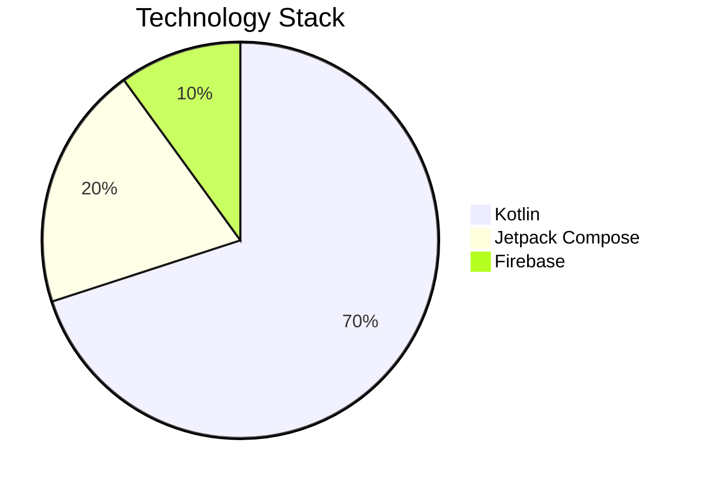

# 📚 BookClub - Your Virtual Reading Sanctuary

<div align="center">
  
  
  [](https://kotlinlang.org)
  [](https://developer.android.com/jetpack/compose)
  [](https://developer.android.com)
  [](https://firebase.google.com)
  [](LICENSE)
  [](https://opensource.org/)
</div>

## 🌟 Features

### 📱 Core Features
| Feature | Description |
|---------|-------------|
| 🔐 **Authentication** | Secure login with Firebase Authentication |
| 📖 **Book Discovery** | Search books by genre using Open Library API |
| 👥 **Club Management** | Create and manage your own book clubs |
| 💬 **Social Reading** | Engage in discussions with fellow readers |
| 📚 **Personal Bookshelf** | Keep track of your books and reading progress |

### 🚀 Advanced Features
| Feature | Description |
|---------|-------------|
| 📅 **Meeting Scheduler** | Schedule and manage club meetings |
| 📊 **Reading Analytics** | Track your reading progress |
| 🌐 **Video Conferencing** | Virtual book discussions |
| ⭐ **Book Reviews** | Share your thoughts on books |
| 🎨 **Modern UI** | Beautiful Jetpack Compose interface |

## 📊 Project Statistics



## 🛠️ Tech Stack

<div align="center">
  
  
  
</div>

## 📚 Libraries Used

| Library | Purpose | Version |
|---------|---------|---------|
| [Jetpack Compose](https://developer.android.com/jetpack/compose) | Modern UI toolkit | Latest |
| [Hilt](https://developer.android.com/training/dependency-injection/hilt-android) | Dependency Injection | Latest |
| [Kotlin Coroutines](https://kotlinlang.org/docs/coroutines-overview.html) | Asynchronous Programming | Latest |
| [Open Library API](https://openlibrary.org/developers/api) | Book Data | Latest |
| [Firebase OAuth](https://firebase.google.com/docs/auth) | Authentication | Latest |
| [Firebase Realtime DB](https://firebase.google.com/docs/database) | Data Storage | Latest |
| [Room Database](https://developer.android.com/training/data-storage/room) | Local Storage | Latest |
| [Retrofit](https://square.github.io/retrofit/) | Networking | Latest |
| [Gson](https://github.com/google/gson) | JSON Parsing | Latest |
| [Coil](https://coil-kt.github.io/coil/) | Image Loading | Latest |

## 🎯 Getting Started

### Prerequisites
- Android Studio Hedgehog or newer
- Android SDK 34 or higher
- Kotlin 1.9.0 or higher
- Firebase account

### Installation
1. Clone the repository
```bash
git clone https://github.com/MShehrozJamshaid/BookClub.git
```

2. Open in Android Studio
3. Sync Gradle files
4. Set up Firebase:
   - Create a new project in Firebase Console
   - Add an Android app with package name from your project
   - Download the new `google-services.json` file
   - Copy `google-services.json` to the app root directory
   - Never commit `google-services.json` to version control!
5. Run the app

## 🤝 Contributing

We love contributions! Please read our [Contributing Guidelines](CONTRIBUTING.md) to learn about our development process.

## 📝 License

This project is free to use and modify. No license restrictions apply.

## 👥 Authors

- **Muhammad Shehroz** - *Initial work* - [MShehrozJamshaid](https://github.com/MShehrozJamshaid)
- **Muhammad Taimoor** - *Part-time worker* - [MTaimoor](https://github.com/taimoor-19)

## 🙏 Acknowledgments

- Open Library for providing book data
- Firebase for backend services
- All contributors who have helped shape this project

---

<div align="center">
  <sub>Built with ❤️ by the BookClub team</sub>
</div>
