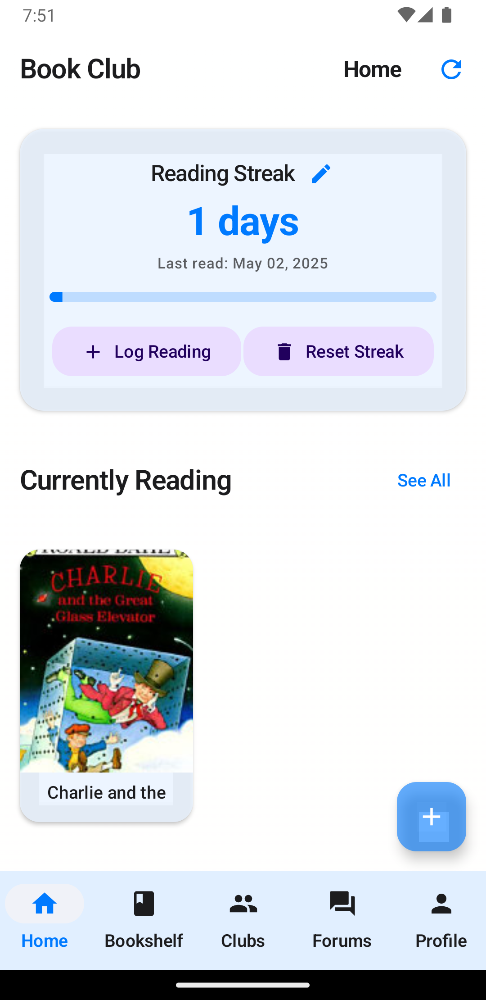
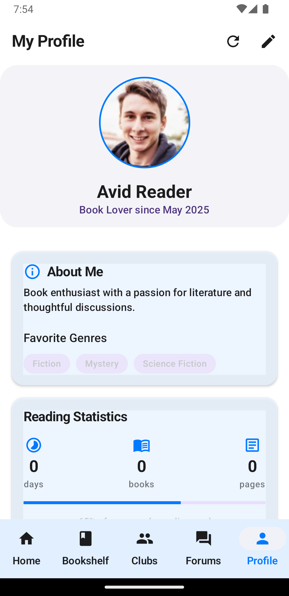
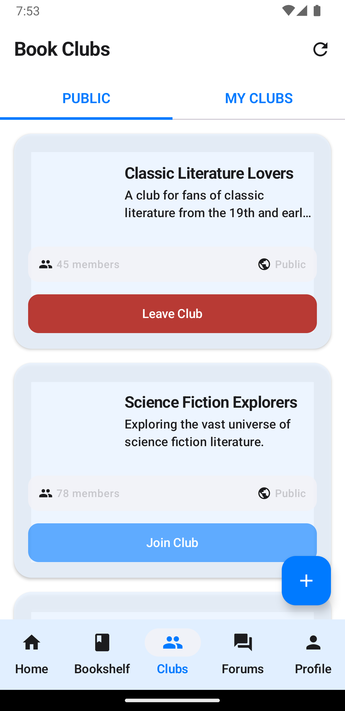
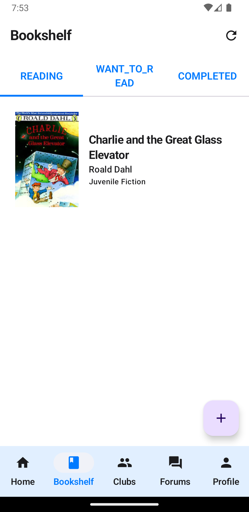
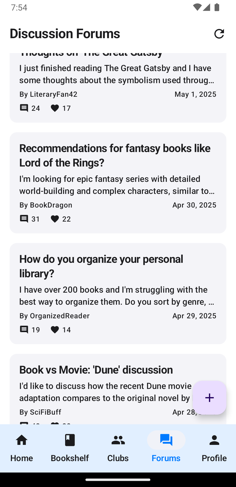
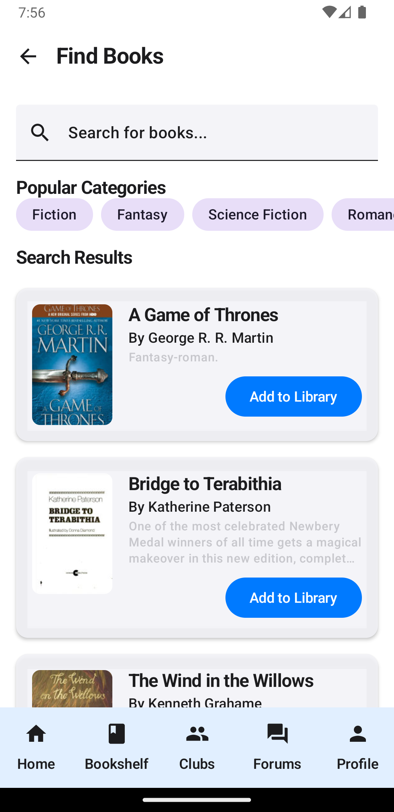
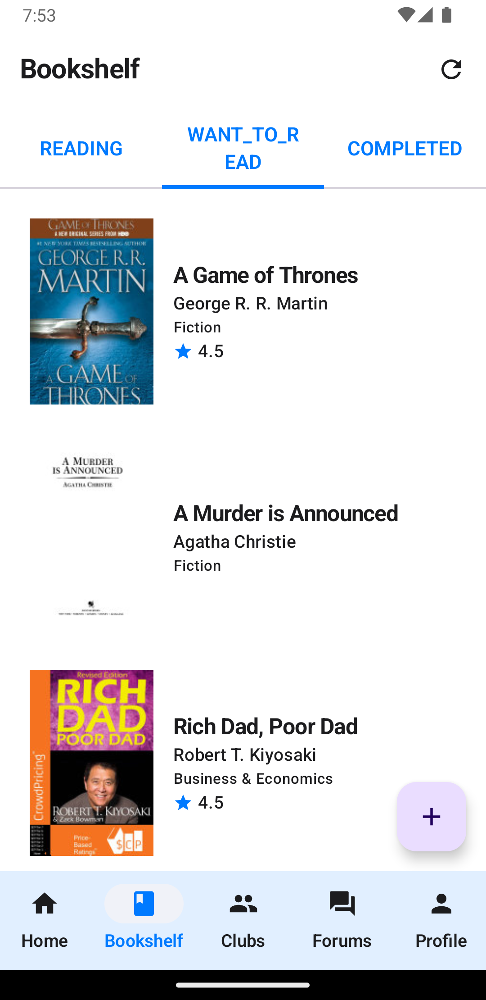
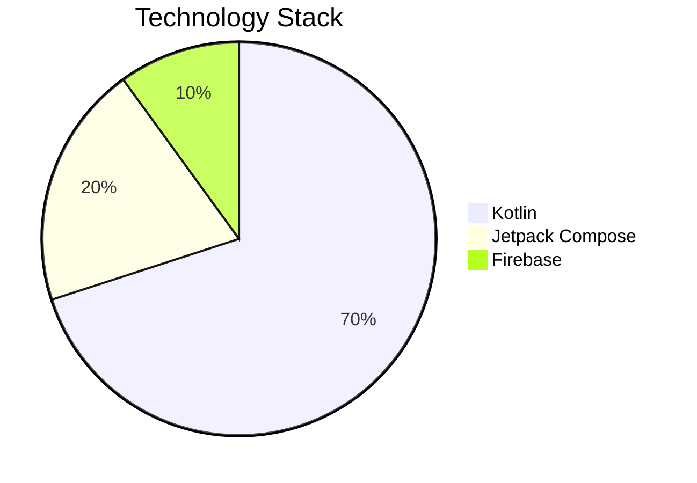

# 📚 BookClub - Your Virtual Reading Sanctuary

<div align="center">
  
  
  [](https://kotlinlang.org)
  [](https://developer.android.com/jetpack/compose)
  [](https://developer.android.com)
  [](https://firebase.google.com)
  [](LICENSE)
  [](https://opensource.org/)
</div>

## 📱 App Preview

<div align="center">
  
### 📱 Screenshots

<table>
  <tr>
    <td align="center"><b>Home Screen</b></td>
    <td align="center"><b>Profile Screen</b></td>
    <td align="center"><b>Reading Streak</b></td>
  </tr>
  <tr>
    <td></td>
    <td></td>
    <td></td>
  </tr>
  <tr>
    <td align="center"><b>Book Clubs</b></td>
    <td align="center"><b>Bookshelf</b></td>
    <td align="center"><b>Forums</b></td>
  </tr>
  <tr>
    <td></td>
    <td></td>
    <td></td>
  </tr>
</table>

### 🔍 Find & Discover Books

<div align="center">
  
</div>

### 📚 Alternate Bookshelf View

<div align="center">
  
</div>

### 🎬 App Demo Video

![https://www.youtube.com/watch?v=7GvR4N3768c&feature=youtu.be]
<p><i>Click the image above to watch the demo video</i></p>

<div align="center">
  <a href="https://www.youtube.com/watch?v=7GvR4N3768c&feature=youtu.be">
    
  </a>
  <p><i>Click the image above to watch the demo video</i></p>
</div>

</div>

## 🌟 Features

### 📱 Core Features
| Feature | Description |
|---------|-------------|
| 🔐 **Authentication** | Secure login with Firebase Authentication |
| 📖 **Book Discovery** | Search books by genre using Open Library API |
| 👥 **Club Management** | Create and manage your own book clubs |
| 💬 **Social Reading** | Engage in discussions with fellow readers |
| 📚 **Personal Bookshelf** | Keep track of your books and reading progress |
| 🔥 **Reading Streak** | Track your daily reading habits |
| 🖌️ **Custom Themes** | Beautiful UI with light cream background |

### 🚀 Advanced Features
| Feature | Description |
|---------|-------------|
| 📅 **Meeting Scheduler** | Schedule and manage club meetings |
| 📊 **Reading Analytics** | Track your reading progress |
| 🌐 **Video Conferencing** | Virtual book discussions |
| ⭐ **Book Reviews** | Share your thoughts on books |
| 🎨 **Modern UI** | Beautiful Jetpack Compose interface |
| 🔁 **Sync Profile Data** | Seamless profile editing experience |
| 🌙 **Glassy UI Effects** | Modern glass morphism design elements |

## 📊 Project Statistics


```mermaid
pie
    title Technology Stack
    "Kotlin" : 70
    "Jetpack Compose" : 20
    "Firebase" : 10
```

## 🛠️ Tech Stack

<div align="center">
  
  
  
</div>

## 📚 Libraries Used

| Library | Purpose | Version |
|---------|---------|---------|
| [Jetpack Compose](https://developer.android.com/jetpack/compose) | Modern UI toolkit | Latest |
| [Hilt](https://developer.android.com/training/dependency-injection/hilt-android) | Dependency Injection | Latest |
| [Kotlin Coroutines](https://kotlinlang.org/docs/coroutines-overview.html) | Asynchronous Programming | Latest |
| [Open Library API](https://openlibrary.org/developers/api) | Book Data | Latest |
| [Firebase OAuth](https://firebase.google.com/docs/auth) | Authentication | Latest |
| [Firebase Realtime DB](https://firebase.google.com/docs/database) | Data Storage | Latest |
| [Room Database](https://developer.android.com/training/data-storage/room) | Local Storage | Latest |
| [Retrofit](https://square.github.io/retrofit/) | Networking | Latest |
| [Gson](https://github.com/google/gson) | JSON Parsing | Latest |
| [Coil](https://coil-kt.github.io/coil/) | Image Loading | Latest |

## 🎯 Getting Started

### Prerequisites
- Android Studio Hedgehog or newer
- Android SDK 34 or higher
- Kotlin 1.9.0 or higher
- Firebase account

### Installation
1. Clone the repository
```bash
git clone https://github.com/MShehrozJamshaid/BookClub.git
```

2. Open in Android Studio
3. Sync Gradle files
4. Set up Firebase:
   - Create a new project in Firebase Console
   - Add an Android app with package name from your project
   - Download the new `google-services.json` file
   - Copy `google-services.json` to the app root directory
   - Never commit `google-services.json` to version control!
5. Run the app

## 📂 Project Structure

```
app/
├─ src/
│  ├─ main/
│  │  ├─ assets/             # App assets including GIFs and logos
│  │  ├─ java/com/.../      # Kotlin source files
│  │  │  ├─ data/           # Data layer (repositories, models, DAOs)
│  │  │  ├─ di/             # Dependency injection
│  │  │  ├─ ui/             # UI components
│  │  │  │  ├─ components/   # Reusable UI components
│  │  │  │  ├─ screens/      # App screens
│  │  │  │  ├─ theme/        # App theme
│  │  │  └─ util/           # Utility classes
│  │  └─ res/               # Android resources
```

## 🧩 Key Features Implementation

### Reading Streak
The app keeps track of your daily reading with an interactive streak counter:
- Automatically updates when you read each day
- Visual progress indicator shows how close you are to your goals
- Manually adjust your reading streak if needed
- Get rewarded for consistent reading habits

### Profile Synchronization
Your profile data stays consistent across the app:
- Changes in the edit profile screen immediately reflect in your profile
- Custom images and bios are preserved
- Reading stats are always up to date

## 🤝 Contributing

We love contributions! Please read our [Contributing Guidelines](CONTRIBUTING.md) to learn about our development process.

## 📝 License

This project is free to use and modify. No license restrictions apply.

## 👥 Authors

- **Muhammad Shehroz** - *Initial work* - [MShehrozJamshaid](https://github.com/MShehrozJamshaid)
- **Muhammad Taimoor** - *Part-time worker* - [MTaimoor](https://github.com/taimoor-19)

## 🙏 Acknowledgments

- Open Library for providing book data
- Firebase for backend services
- All contributors who have helped shape this project

---

<div align="center">
  <sub>Built with ❤️ by the BookClub team</sub>
</div>
