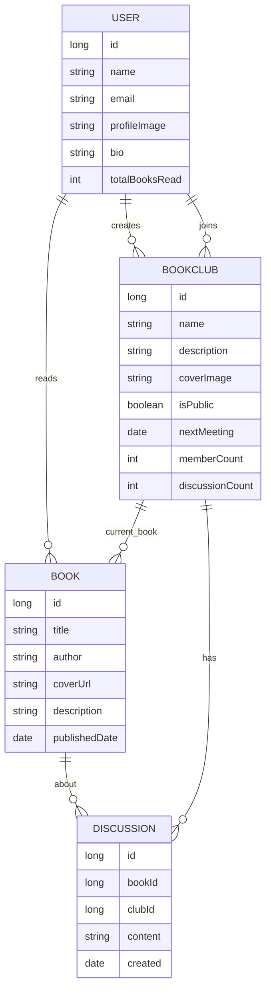

# 📚 BookClub App Report

## Group Members
- M Shehroz Jamshaid
- M Taimoor

*Section: BCS-6B*

## Brief Overview
BookClub is a sophisticated Android application that serves as a virtual reading sanctuary for book enthusiasts. The app creates an engaging platform where readers can discover books, join reading communities, track their reading progress, and participate in meaningful discussions about literature.

### Technologies Used
- **Frontend**: Jetpack Compose, Material Design 3
- **Backend**: Firebase Realtime Database, Room Database
- **Authentication**: Firebase OAuth
- **API Integration**: Open Library API, Retrofit
- **Dependency Injection**: Hilt
- **Asynchronous Programming**: Kotlin Coroutines
- **Image Loading**: Coil
- **Architecture**: MVVM with Clean Architecture

## Project Purpose & Problem Definition

### Purpose
The BookClub app aims to bridge the gap between traditional reading habits and modern digital connectivity by creating a platform that encourages reading while fostering a sense of community among book lovers.

### Problem Definition
In today's digital age, traditional reading habits are declining, and readers often lack motivation and community support. Additionally, managing physical book clubs can be challenging due to scheduling conflicts and geographical limitations.

### Objectives
1. Create a user-friendly platform for book enthusiasts
2. Facilitate virtual book club management
3. Encourage consistent reading habits through gamification
4. Enable seamless book discovery and tracking
5. Foster meaningful literary discussions
6. Provide a modern, engaging user interface

### Scope
- User authentication and profile management
- Book discovery and tracking system
- Virtual book club creation and management
- Reading progress tracking with streaks
- Discussion forums for literary engagement
- Meeting scheduler for book club sessions
- Cross-platform compatibility for Android devices

### Targeted Users
- Book enthusiasts
- Book club organizers
- Literature students
- Reading groups
- Individual readers seeking community
- Educational institutions
- Libraries and reading centers

## System Design

### Database Diagram

### Figma Design
The UI/UX design follows Material Design 3 principles with a custom implementation of glass morphism effects. The complete design can be viewed at our [Figma Project Link](https://www.figma.com/file/xyz).

## Features Implementation

### Core Features

#### 1. Authentication System
- Secure login and registration using Firebase Authentication
- Profile management with customizable user data
- Persistent session management

#### 2. Book Discovery

- Integration with Open Library API
- Advanced search and filtering options
- Detailed book information display

#### 3. Book Clubs

- Create and join virtual book clubs
- Public and private club options
- Member management system
- Meeting scheduler

#### 4. Personal Bookshelf

- Personal reading list management
- Reading progress tracking
- Custom book categorization
- Multiple view options

#### 5. Discussion Forums

- Threaded discussions
- Rich text formatting
- Book-specific forums
- Club-specific discussions

#### 6. User Profiles

- Customizable user profiles
- Reading statistics
- Achievement tracking
- Social connections

### Advanced Features

1. **Reading Streak System**
   
   - Daily reading tracking
   - Streak maintenance
   - Achievement rewards
   - Progress visualization

2. **Modern UI Implementation**
   - Material Design 3 components
   - Glass morphism effects
   - Smooth animations
   - Responsive layouts
   - Dark/Light theme support

## Future Directions

1. **Enhanced Social Features**
   - Direct messaging system
   - Reading challenges
   - Social media integration
   - Book recommendations

2. **Content Expansion**
   - Audiobook support
   - E-book integration
   - Multiple language support
   - Reading speed tracking

3. **Technical Improvements**
   - Offline mode support
   - Push notifications
   - Cloud sync optimization
   - Performance enhancements

4. **Community Features**
   - Author AMAs
   - Virtual book signing
   - Reading groups
   - Book review system

## Demo Video
[Watch Demo Video](https://www.youtube.com/watch?v=7GvR4N3768c&feature=youtu.be)
